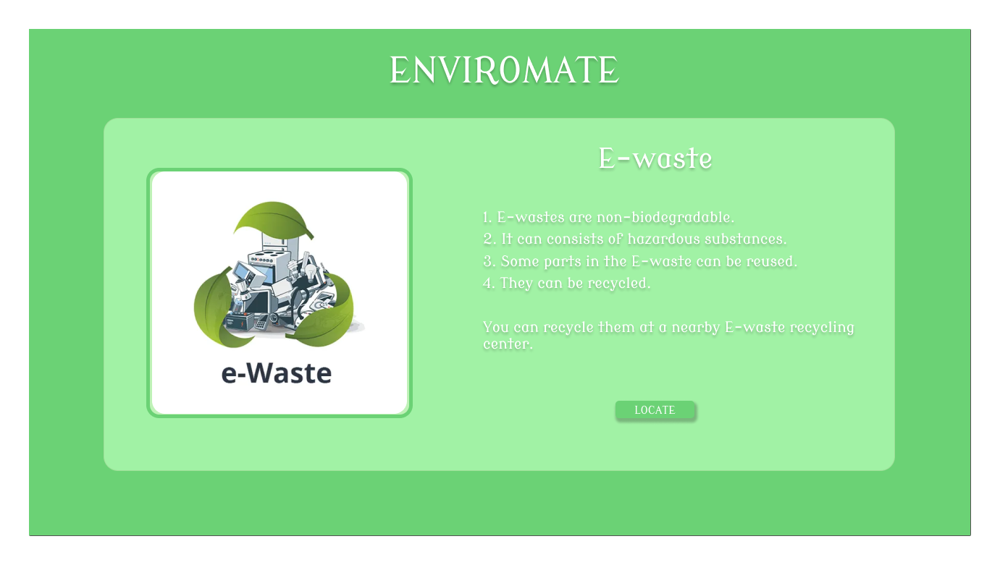
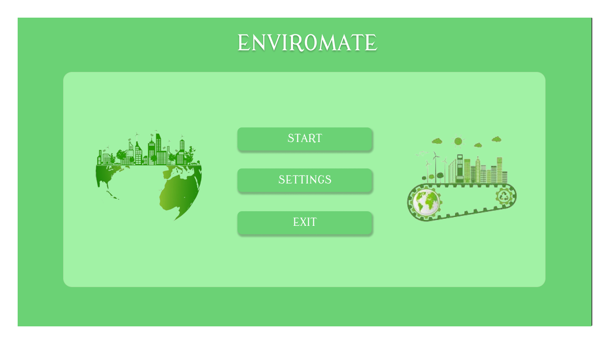

# Enviromate – Smart Waste Classifier

**Enviromate** is a Python desktop application that uses a webcam to scan and classify waste items into categories such as **Paper, Metal, Plastic, E-waste**, and more. It provides information about the waste’s biodegradability, recycling tips, and environmental impact, and helps users locate the **nearest recycling centers** for recyclable items.

---

## Features

- **Real-time Image Detection:** Scans and identifies waste items using your webcam.  
- **Waste Classification:** Categorizes items as Paper, Metal, Plastic, E-waste, etc.  
- **Informative Details:** Provides information about the waste type, biodegradability, and eco-friendly disposal methods.  
- **Locate Recycling Centers:** Navigates to the nearest recycling shop if the item is recyclable.  
- **User-Friendly Interface:** Built with **Tkinter**, providing an intuitive and interactive experience.  

---

## Technology Stack

- **Python 3.x**  
- **Tkinter** – GUI interface  
- **OpenCV** – Real-time image detection via webcam  
- **Machine Learning Model** – Classifies waste types  
- **Web Integration** – Google Maps link for locating nearby recycling centers  

---

## Installation & Usage

1. **Clone the repository:**
   ```bash
   git clone https://github.com/yourusername/Enviromate.git
   ```
2. **Install dependencies:**
   ```bash
   pip install -r requirements.txt
   ```
3. **Run the application:**
   ```bash
   python main.py
   ```
4. **Using the App:**
   ```text
   - Open the application and allow access to your webcam.
   - Place a waste item in front of the camera.
   - The app will detect the type of waste and display relevant details.
   - Click the Locate button to navigate to the nearest recycling center if the item is recyclable.
   ```
5. **Contributing:**
   ```bash
   # Fork the repository
   git checkout -b feature-name
   # Make your changes and commit
   git commit -m "Add new feature"
   # Push to the branch
   git push origin feature-name
   # Open a pull request
   ```

---

## Screenshots

<p align="center">
  
</p>

<p align="center">
  
</p>

*Replace the above images with actual screenshots from your app.*

---

## License

Currently, this project does not have a license, meaning **all rights are reserved**. If you want to make it open-source, consider adding an **MIT License** or another license of your choice.

---

## Contact

For any questions, feel free to contact:

- **Your Name / GitHub Profile:** [YourGitHub](https://github.com/Dakshin211/)  
- **Email:** autodesk.dakshin211@gmail.com
